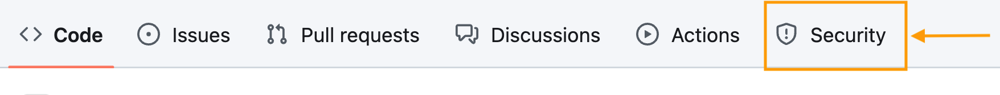
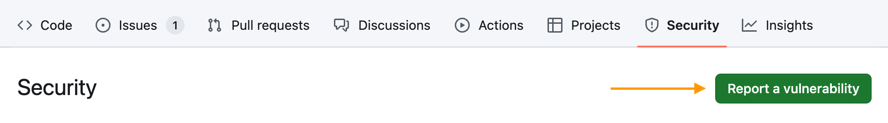
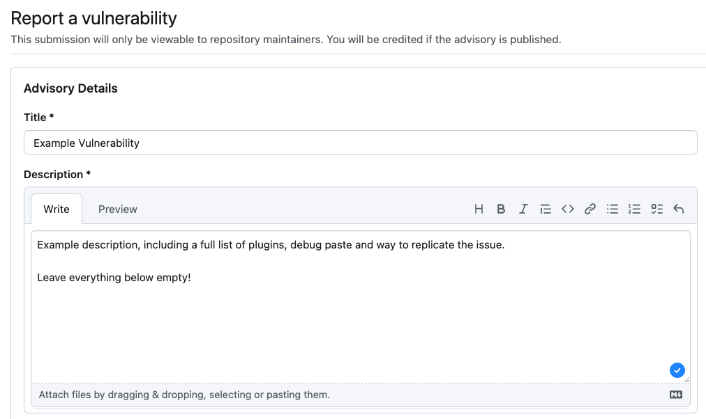

## Reporting Security Vulnerabilities

Please report security vulnerabilities through the "Security" tab on GitHub.

Therefore, click on the "Security" button:

<picture>
    <source media="(prefers-color-scheme: dark)" srcset="assets/security/tab-dark.png">
    
</picture>

Now, click on "Report a vulnerability":

<picture>
    <source media="(prefers-color-scheme: dark)" srcset="assets/security/report-dark.png">
    
</picture>

In the form, add a "Title" summing the vulnerability up.

In the "Description" field, provide as much information about the vulnerability, including:
- The output of `/version`
- The URL of a `/plot debugpaste` or `/fawe debugpaste`
- Steps to replicate the issue
- Error logs and stack traces, if applicable

<picture>
    <source media="(prefers-color-scheme: dark)" srcset="assets/security/form-dark.png">
    
</picture>

Leave everything else at the bottom of the page, below the "Description" box, empty. Project maintainers will fill it out for you.

To submit the report, click on "Submit report":

<picture>
    <source media="(prefers-color-scheme: dark)" srcset="assets/security/submit-dark.png">
    
</picture>

The form is configured in such a way that only the reporter and the IntellectualSites project maintainers can see the details.
By restricting access to this potentially sensitive information, we can work on a fix and deliver it, before a vulnerability becomes well known.

### Issue Handling
If you have submitted a properly filled out report, the project maintainers will look into your issue shortly.   
Keep in mind, that we may choose to reject issues, if they are not feasible for us to address, due to limitations of the Minecraft codebase.

### Attribution policy
We will credit reporters who informed us in private by filling out the form above in security releases published.
